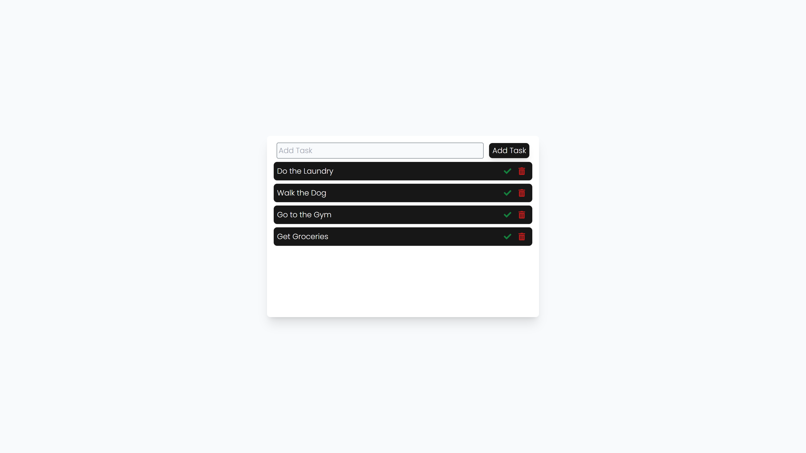
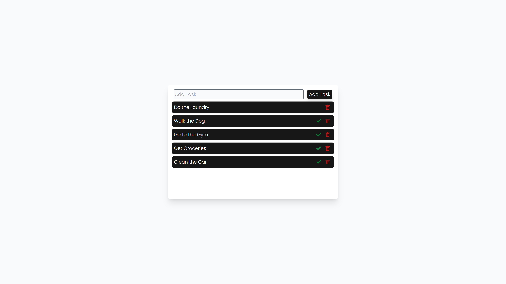

# MERN Task Manager

This is a CRUD app that allows users to view existing tasks, add new tasks, mark them as completed, and delete them. The application was built around the MERN stack and Next.js.

## Adding a Task

By typing into the text field and clicking 'Add Task', a new task is added to the database and is added to the lists of existing tasks.

## Marking a Task as 'Done'

By clicking the green tick on a task, it will be edited in the database and reflect as completed with a strike through.

## Deleting a Task

By clicking the red trash can on a task, it will be deleted in the database and removed from the list of tasks.

## Technologies Used
- Next.js / React.js
- Tailwind CSS
- Axios
- Node.js / Express.js
- MongoDB / Mongoose